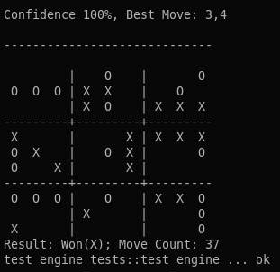

# Stoctopus

My attempt at implementing a Monte Carlo Tree Search (MCTS) game engine for [Ultimate Tic Tac Toe](https://bejofo.net/ttt). Uses SIMD and rayon to make game logic faster (probably).

Note: Evaluation (Confidence) is broken.

## Demo

```sh
rustup default nightly
cargo test -- --nocapture
```


